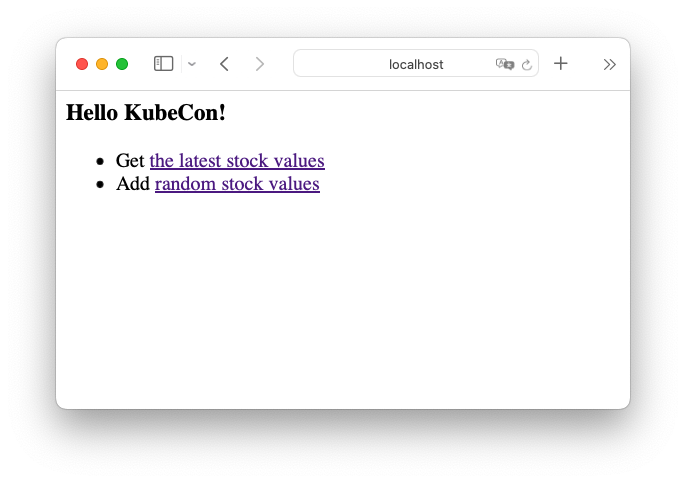
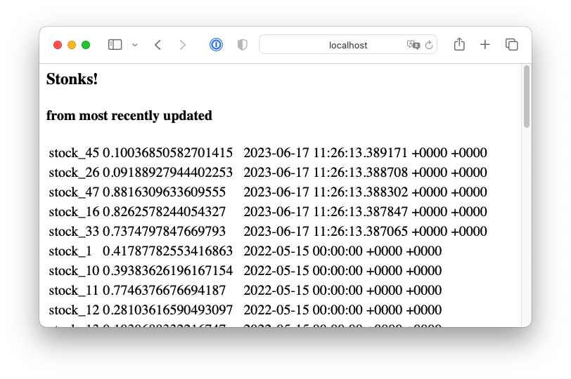

In this post I'd like to take you on the full journey moving your app written
against PostgreSQL into a containerized, scalable app on a local Kubernetes
cluster running queries against a CloudNativePG database.
It is surprisingly quick and easy. You should be able to get through this in 10
minutes.

Why would you want to develop your app on a local Kubernetes cluster?
There are two powerful reasons:

1. It unlocks DevOps for database-backed applications. One of the tenets of
  DevOps is to blur the line between development and production. A developer
  writing against PostgreSQL today may install the database locally,
  or perhaps use a `docker` image to run the database locally, when developing
  applications.
  However, those applications will be deployed into an environment that
  is very different, with hot standby replicas, availability zones, and
  backup/restore solutions.
  Developing against CloudNativePG, developers can now test the resiliency and
  responsiveness of their applications in an environment that mirrors
  production.

1. It makes available a lot of powerful components built by the Kubernetes
  community. For example, in the
  [Quickstart guide](http://cloudnative-pg.io/documentation/current/quickstart/)
  for CloudNativePG you will find a section that takes you through installing
  the [Prometheus Operator](https://prometheus-operator.dev), with a
  [Grafana](https://grafana.com) dashboard to get metrics for your database.
  In a previous post, you can learn how to deploy
  [Hasura](https://hasura.io) to provide a
  [GraphQL layer for your CloudNativePG cluster]().

We're going to be moving a very simple webapp written in Go that uses a
PostgreSQL database. It only has two endpoints, one showing a list of stock
tickers, another updating the listing with new stock values.

The only change the app need be aware of, once we containerize it and move
it into our local Kubernetes cluster, is that the DB connection string will use
the *service* created by CloudNativePG  for the database, rather than a regular
host name.

In a properly written [12-factor](https://12factor.net) webapp, the host,
user credentials and database names would be injected from environment
variables (or an injected
[PGPASSFILE](https://www.postgresql.org/docs/current/libpq-pgpass.html)).
If your webapp is written this way, no changes should be necessary to move it
to Kubernetes / CloudNativePG.

Here's the game plan:

1. Follow the quickstart guide to get a local Kubernetes cluster with the
  CloudNativePG operator deployed
1. Containerize the webapp with the provided Dockerfile
1. Deploy a PostgreSQL cluster with CloudNativePG
1. Populate the database with the initial schema and data
1. Install your webapp with the provided Deployment + Service YAML
1. Start a port-forwarding so you can view the webapp from your computer's
  web browser

### Hands-on

If you don't yet have a local Kubernetes cluster, please refer to the
[Quickstart guide](http://cloudnative-pg.io/documentation/current/quickstart/).
You will need `kind` installed, as well as `kubectl` and `docker`.
If you want to run and compile the webapp locally to kick the tires, you will
also need the [Go compiler](https://go.dev) - though this is not necessary if
you will only run it containerized.

We're going to create a Kubernetes cluster from scratch using
[KinD](https://kind.sigs.k8s.io), and call it `webapp-demo`.

``` sh
kind create cluster --name webapp-demo
```

This should run quickly. You can make sure it's ready:

``` sh
kubectl get nodes

NAME                        STATUS   ROLES           AGE    VERSION
webapp-demo-control-plane   Ready    control-plane   114s   v1.27.1
```

It's a cluster with only one *node*, but you can easily create clusters with
several worker nodes with KinD.

#### CloudNativePG operator

Now let's install the CloudNativePG operator. As explained in the
[installation document](https://cloudnative-pg.io/documentation/current/installation_upgrade/),
you can deploy it by applying the latest manifest.
At the time of this writing, this is version 1.20.1:

``` sh
kubectl apply -f \
  https://raw.githubusercontent.com/cloudnative-pg/cloudnative-pg/release-1.20/releases/cnpg-1.20.1.yaml
```

The installation should take seconds, and you should find the deployment
ready:

``` sh
kubectl get deployments -n cnpg-system

NAME                      READY   UP-TO-DATE   AVAILABLE   AGE
cnpg-controller-manager   1/1     1            1           18s
```

#### Containerizing the webapp

You can clone the webapp from its
[github project page](https://github.com/jsilvela/kubecon-webapp-cnpg).
From the top-level directory of the checked-out project, containerize the app
by running:

``` sh
docker build -t myapp .
```

You should be able to see the image `myapp` in the `docker images` listing.
Now we'd like to *load* this image into our KinD cluster's nodes.

``` sh
kind load docker-image myapp:latest --name webapp-demo
```

(*) You could have uploaded your Dockerfile into a public container registry,
and used its public handle in the following YAML files, but
for local development and quick iteration, directly loading it may be preferable.

#### Creating a PostgreSQL cluster

Before we deploy the app, let's create the simplest possible CloudNativePG
cluster.

``` sh
kubectl apply -f \
  https://raw.githubusercontent.com/cloudnative-pg/cloudnative-pg/main/docs/src/samples/cluster-example.yaml
```

This YAML is part of a set of example cluster manifests provided with
CloudNativePG that show off various features and are ready to deploy.
You can find out more
[in the CloudNativePG documentation](https://cloudnative-pg.io/documentation/current/samples/).

In a few seconds, you should have the PostgreSQL cluster `cluster-example` up
and ready. It is a 3-instance cluster, with a primary and two hot-standbys.

``` sh
kubectl get clusters

NAME              AGE     INSTANCES   READY   STATUS                     PRIMARY
cluster-example   2m23s   3           3       Cluster in healthy state   cluster-example-1
```

#### Populating the database

The database is empty, but the webapp assumes the existence of two tables
representing stocks and stock tickers:

In the file [`example-changelog.sql`](https://raw.githubusercontent.com/jsilvela/kubecon-webapp-cnpg/main/migrations/example-changelog.sql)
you can find:

``` sql
--changeset jaime.silvela:1 labels:kubecon-demo
--comment: let's start off with 50 stocks
create table stocks as
    select 'stock_' || generate_series as stock
    from generate_series(1, 50);
--rollback DROP TABLE stocks;

--changeset jaime.silvela:2 labels:kubecon-demo
--comment: lets add a bunch of random stock values
create table stock_values as
    with dates as (
        SELECT generate_series as date
        FROM generate_series('2020-01-01 00:00'::timestamp,
                '2022-05-15 00:00', '24 hours')
    )
    select stock, date, random() as stock_value
    from stocks cross join dates;
```

There are some comments there that are relevant for
[*Liquibase*](https://www.liquibase.org). By all means, for development of
applications, we strongly encourage that you use a **database migration tool**,
but for this demo we can just push through and apply the changes manually.

Check with `kubectl get clusters` which is the primary instance of
`cluster-example`. Let's assume it's `cluster-example-1`, and let's open
a `psql` terminal on it:

``` sh
kubectl exec -ti cluster-example-1 -- psql app
```

This will open a session as the `postgres` superuser.
Applications should run database code with a less-privileged user.
By default, CloudNativePG creates a user called `app`, and a database owned
by it, also called `app`. This is a very reasonable default, but of course you
can configure your clusters to fit your needs.

The tables above should be created by the `app` user.
In our `psql` session, let's switch:

``` sql
SET role TO app;
```

Now you can simply copy and paste the SQL above. You should
see two tables:

``` text
app=> \dt
           List of relations
 Schema |     Name     | Type  | Owner
--------+--------------+-------+-------
 public | stock_values | table | app
 public | stocks       | table | app
(2 rows)
```

There are 50 stocks in the `stocks` table, and 43300 stock values in
the `stock_values` table:

``` sql
# SELECT * FROM stock_values ORDER BY date DESC;

  stock   |            date            |      stock_value
----------+----------------------------+------------------------
 stock_43 | 2022-05-15 00:00:00        |     0.1512641999535136
 stock_50 | 2022-05-15 00:00:00        |     0.6586900953813299
 stock_49 | 2022-05-15 00:00:00        |   0.052571752658662874
 stock_48 | 2022-05-15 00:00:00        |     0.8326971243933354
 stock_47 | 2022-05-15 00:00:00        |     0.2769466296850802
 stock_46 | 2022-05-15 00:00:00        |     0.6096716690131085
 . . .
 . . . snipped
```

#### Deploying the webapp

OK, we're now ready to deploy our webapp!
The [webapp-deploy.yaml](https://raw.githubusercontent.com/jsilvela/kubecon-webapp-cnpg/main/webapp-deploy.yaml)
manifest contains a *deployment* and a *service* for our webapp.

The deployment specifies we want 3 replicas for our webapp, and passes
the credentials for the `app` user for `cluster-example`.
The Service builds a load balancer to route traffic to any of the 3 replicas.

Simply apply the file:

```sh
kubectl apply -f webapp-deploy.yaml

service/mywebapp created
deployment.apps/mywebapp created
```

Right away you can see the 3 pods running the web server, as well as the
3 pods running our database:

``` sh
kubectl get pods

NAME                        READY   STATUS    RESTARTS   AGE
cluster-example-1           1/1     Running   0          27m
cluster-example-2           1/1     Running   0          27m
cluster-example-3           1/1     Running   0          27m
mywebapp-548d97848b-fprvh   1/1     Running   0          20s
mywebapp-548d97848b-vrv8f   1/1     Running   0          20s
mywebapp-548d97848b-whnnp   1/1     Running   0          20s
```

You can also see the load balancer for our webapp, as well as 3 services
for `cluster-example` (we'll say more about them shortly.)

``` sh
kubectl get svc

NAME                 TYPE           CLUSTER-IP      EXTERNAL-IP   PORT(S)          AGE
cluster-example-r    ClusterIP      10.96.103.136   <none>        5432/TCP         29m
cluster-example-ro   ClusterIP      10.96.252.145   <none>        5432/TCP         29m
cluster-example-rw   ClusterIP      10.96.49.83     <none>        5432/TCP         29m
mywebapp             LoadBalancer   10.96.128.43    <pending>     8088:30016/TCP   96s
```

Our webapp is now fully running!
However, our local Kind cluster is not generally visible to the local network.
Let's add port forwarding of the application port for HTTP:

``` sh
kubectl port-forward service/mywebapp  8080:8088

Forwarding from 127.0.0.1:8080 -> 8080
Forwarding from [::1]:8080 -> 8080
```

You should now be able to see the app in
[http://localhost:8080](http://localhost:8080)



Clicking on the *latest stock values* link:



You can also click on the *"Add random stock values"* link, and then go back on
the stocks page, and you'll see a few changed stock values.

Our webapp is deployed now as promised!

### All in? Partially in?

We mentioned that our web application would use the *service* associated with
our CloudNativePG cluster. In fact, the service `cluster-example-rw` will always
point to the cluster's primary instance. If there is a failover or a
switchover, the service will point to the new primary.

Notice there was another service called `cluster-example-ro`, which, you might
guess, acts as a load-balancer for our read-only replicas.

We glossed over authentication. Our Go app uses environment variables for the
credentials to the database. In the webapp deployment manifest
[webapp-deploy.yaml](https://raw.githubusercontent.com/jsilvela/kubecon-webapp-cnpg/main/webapp-deploy.yaml)
you can find the following section:

``` yaml
        ... snipped ...
        env:
        - name: PG_PASSWORD
          valueFrom:
            secretKeyRef:
              name: cluster-example-app
              key: password
        - name: PG_USER
          valueFrom:
            secretKeyRef:
              name: cluster-example-app
              key: username
```

This assumes the existence of a
[Kubernetes secret](https://kubernetes.io/docs/concepts/configuration/secret/)
called `cluster-example-app`. Secrets are how Kubernetes handles sensitive
material like passwords or certificates.
The secret `cluster-example-app` was created by default by CloudNativePG,
(named `<clusterName>-app` for the `app` user).

By assuming the existence of a secret, and using *convention over
configuration*, our webapp deployment manifest had no need to decode the
credentials.

Secrets and Services though, are only available *within* a Kubernetes cluster.
What if you wanted to deploy the database with CloudNativePG inside Kubernetes,
but run the webapp, or some other components of the system, outside
Kubernetes?

You can, of course, although you lose part of the convenience. We already
saw the possibility of doing port-forwarding. Port-forwarding could be used to
expose one or more of the CloudNativePG services over regular TCP ports.
Credentials too would be handled without much trouble.

For further information, please refer to the [use cases discussion](https://cloudnative-pg.io/documentation/current/use_cases/).

### Where to go from here

We've created a replicated webserver running inside a Kubernetes cluster, and
a PostgreSQL cluster with 2 standbys, in under 10 minutes.
We mentioned DevOps and blurring the line between development and production.

How about testing some failure scenarios?

We could create load on the webapp, introducing new stock values by repeatedly
hitting the `/update` endpoint.
Using the [*hey*](https://github.com/rakyll/hey) load generator:

``` sh
hey -z 100s -q 1 -c 2  http://localhost:8080/update
```

And during this time, how about killing the primary instance?

``` sh
kubectl delete pod cluster-example-1
```

The webapp might be momentarily unavailable, and you might see
`pq: the database system is shutting down` in the *latests stocks* page.
Recovery should take no longer than 1-2 seconds, as a replica would be
promoted by the CloudNativePG operator.
Since the webapp was written using the service, it will recover once
the new primary is in place.

But you might think that for read-only endpoints like the page showing
the latest stock values, the webapp could leverage the `cluster-example-ro`
service.
If it did, there would not be an outage when we killed the primary. These
are tradeoffs that you can now explore meaningfully at development time.

You could add connection pooling. CloudNativePG offers support out of the
box for [PgBouncer](https://www.pgbouncer.org/) through the `Pooler` resource.
You can find more information in the
[connection pooling document](https://cloudnative-pg.io/documentation/current/connection_pooling/).

There's a lot of power to experiment and iterate through your system design.

We mentioned in the beginning that the
[quickstart guide](http://cloudnative-pg.io/documentation/current/quickstart/)
takes you through adding Prometheus / Grafana monitoring for your database
cluster. It would not be difficult to publish Prometheus metrics for your
webserver too, and have a dashboard for your full system.

The point is that you have at your disposal an environment where you can test
disaster recovery, realistic loads, scaling, upgrades, and any other day-2
operations you could want.

It's a good time to be a developer!
