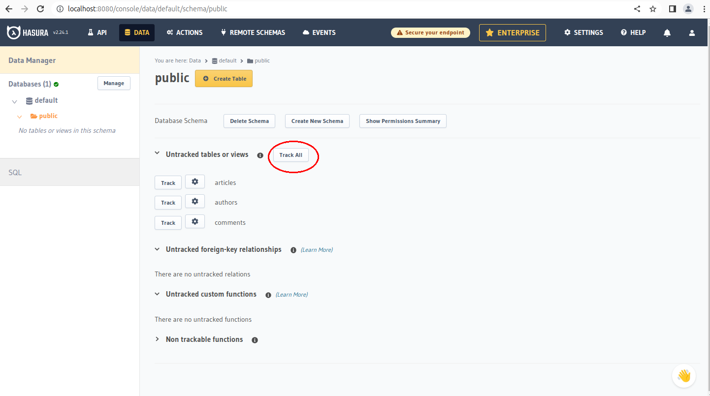

CloudNativePG is a production-grade PostgreSQL operator for Kubernetes. It is
also a great way to bootstrap a comfortable development environment.

In this blog post, we'll create a CloudNativePG cluster with a few example
tables, and we'll use [Hasura](https://hasura.io) to bootstrap a
[GraphQL](https://graphql.org) API that your
application can use to store and retrieve data efficiently.

## Getting set up with Kubernetes and KinD

A Kubernetes cluster is required to follow this tutorial.
You can create a test cluster on your laptop using Docker and
[KinD](https://kind.sigs.k8s.io/docs/user/quick-start/).
You will also need the CLI tool `kubectl`. Please refer to
the [kubernetes guide](https://kubernetes.io/docs/tasks/tools/)
for details.

## Installing CloudNativePG

To install CloudNativePG, we'll follow the [installation and
upgrade](https://cloudnative-pg.io/documentation/current/installation_upgrade/)
section of the CloudNativePG website.

At the time of writing, the latest version is 1.20. The following
command will deploy the CloudNativePG operator on your local Kubernetes cluster:

```shell
kubectl apply -f https://raw.githubusercontent.com/cloudnative-pg/cloudnative-pg/release-1.20/releases/cnpg-1.20.0.yaml
```

We should wait until CloudNativePG is up and running.
It's enough to wait until the READY column shows `1/1`. Should be a few seconds:

``` sh
$ kubectl get deployments -n cnpg-system
NAME                      READY   UP-TO-DATE   AVAILABLE   AGE
cnpg-controller-manager   1/1     1            1           6d16h
```

## Creating a PostgreSQL cluster

The simplest CloudNativePG example cluster creates a High-Availability
architecture with a primary database node and two replicas. We can simply
apply the example manifest included with CloudNativePG:

``` sh
$ kubectl apply -f https://cloudnative-pg.io/documentation/1.20/samples/cluster-example.yaml
cluster.postgresql.cnpg.io/cluster-example created
```

We should now wait for the cluster to be up and running:

``` sh
$ kubectl wait --for=condition=Ready cluster/cluster-example
cluster.postgresql.cnpg.io/cluster-example condition met
```

Now we have our sandbox ready for testing.

## Installing Hasura

The Hasura GraphQL GitHub repo [includes some Kubernetes
manifests](https://github.com/hasura/graphql-engine/tree/stable/install-manifests/kubernetes)
we can use as a starting point.
Please refere to the [Hasura documentation](https://hasura.io/docs/latest/deployment/deployment-guides/kubernetes/)
for further information about the Kubernetes manifests.

We must inject our PostgreSQL credentials into the Hasura deployment manifest,
and we'll do that using the secret automatically created by the CloudNativePG
operator.

CloudNativePG creates an unprivileged user called `app` (you can override the
name) for applications to use. It uses [*secrets*](https://kubernetes.io/docs/concepts/configuration/secret/)
to manage user credentials.
The `cluster-example-app` secret created by the operator contains the
credentials for the `app` user.
A database called `app` is also created, and set as owned by the `app` user.

CloudNativePG creates some [*services*](https://kubernetes.io/docs/concepts/services-networking/service/) to expose and manage the database network
connections. In particular, given our cluster named `cluster-example`, there
is a `cluster-example-rw` service always targeting the primary instance. We
will use the service for connection.

To connect our PostgreSQL cluster to the Hasura deployment, then, we will:

* Inject the password into the `PGPASSWORD` environment variable in the Hasura
  manifest
* Use `cluster-example-app-rw` as a target hostname.
* Use `app` as the database name.

```yaml
apiVersion: apps/v1
kind: Deployment
metadata:
  name: hasura
spec:
  [...]
  template:
    spec:
      containers:
      - name: hasura
        env:
        - name: HASURA_GRAPHQL_DATABASE_URL
          value: postgres://app@cluster-example-rw
        - name: PGPASSWORD
          valueFrom:
            secretKeyRef:
              name: cluster-example-app
              key: password
```

The complete manifest can be found in the file [`hasura-deployment.yaml`](hasura-deployment.yaml).

You can deploy it with:

``` sh
kubectl apply -f hasura-deployment.yaml
```

And make sure it came up:

``` sh
$ kubectl get deployments
NAME     READY   UP-TO-DATE   AVAILABLE   AGE
hasura   1/1     1            1           30s
```

We now need a service for our applications to use. An example can be found in
the file [hasura-service.yaml](hasura-service.yaml).
Again, we can simply apply it:

``` sh
kubectl apply -f hasura-service.yaml
```

We should see the hasura service, along with the services CloudNativePG created
for our database cluster:

``` sh
$ kubectl get services                
NAME                 TYPE        CLUSTER-IP      EXTERNAL-IP   PORT(S)    AGE
…
cluster-example-rw   ClusterIP   10.96.164.82    <none>        5432/TCP   19m
hasura               ClusterIP   10.96.57.238    <none>        80/TCP     7s
```

## Playing with Hasura's UI

Now you can create tables and play with GraphQL using Hasura's UI. All we need
is to expose Hasura's service to our computer with the following:

``` sh
$ kubectl port-forward service/hasura 8080:80
Forwarding from 127.0.0.1:8080 -> 8080
Forwarding from [::1]:8080 -> 8080
Handling connection for 8080
```

We can now access Hasura as a local website at
[http://localhost:8080](http://localhost:8080).


## Migrations

Hasura maps GraphQL schemas to PostgreSQL tables by storing metadata
inside the database. Metadata are managed and versioned in a Hasura project,
which is applied to the database via the Hasura CLI.

To follow this section, you will need to [install the Hasura CLI](https://hasura.io/docs/latest/hasura-cli/install-hasura-cli/)

The project we're going to use for this blog article can be found
[here](https://github.com/leonardoce/hasura-blog).

Hasura projects can be scaffolded with `init`, which will create a new project
folder[^1]:

``` sh
$ hasura init
? Name of project directory ? hasura
INFO directory created. execute the following commands to continue:

  cd hasura
  hasura console 
```

To create new tables, we'll need to create a new migration. We can do that with:

``` sh
$ hasura migrate create init
? Select a database to use default
INFO Created Migrations                           
INFO Migrations files created                      name=init version=1682932686238
```

In the above, we accepted the default `default` database proposed by the CLI.

Migrations are composed of two SQL files: `up.sql` and `down.sql`. The command
above created a new directory called `migrations` inside the project directory,
with a subdirectory for the database (`default`), and inside it a subdirectory
for the migration we're about to apply:

``` sh
$ cd migrations/default/<version-ID>_init
$ ls
down.sql  up.sql
```

We'll add the queries to create our tables in `up.sql`:

```sql
CREATE TABLE authors (
    id SERIAL PRIMARY KEY,
    name TEXT UNIQUE
);

CREATE TABLE articles (
    id SERIAL PRIMARY KEY,
    author_id INTEGER NOT NULL REFERENCES authors (id),
    title TEXT NOT NULL,
    content TEXT NOT NULL
);

CREATE TABLE comments (
    id SERIAL PRIMARY KEY,
    author_id INTEGER NOT NULL REFERENCES authors (id),
    article_id INTEGER NOT NULL REFERENCES articles (id),
    content TEXT NOT NULL
);
```

And the queries deleting the tables in `down.sql`:

```sql
DROP TABLE comments;
DROP TABLE articles;
DROP TABLE authors;
```

After having created the migration we can apply it with:

``` sh
$ hasura migrate apply
```

[This
commit](https://github.com/leonardoce/hasura-blog/commit/e75cfbb7a262f286d818e471904da314875bef58)
contains the migrations code.

## Mapping the SQL schema to GraphQL

We need now to map the tables and the relationship in our database in a GraphQL
schema.
The easiest way to do this is to use the Hasura GUI you have at
[http://localhost:8080](http://localhost:8080) and:

1. click on the `Data` tab, and inside the `default` database choose the
   `public` schema

2. track all the tables

3. track all the relationships




Having done that, we need our Hasura project to reflect what we did..
We can do that with:

```
$ hasura metadata export
```

[This commit contains the generated metadata](https://github.com/leonardoce/hasura-blog/commit/32fd8a202f42fb07fe25e2c66c1fbac26cbb2d96)

## Executing our first mutation

We can now execute our first GraphQL mutation on our database to create a new
article and a new author at the same time:

This is the mutation we would like to apply:

```graphql
mutation AddArticle($title: String, $content: String, $author: String) {
	insert_articles_one(object: {
    title: $title,
    content: $content,
    author: {
      data: {
        name: $author,
      },
      on_conflict: {
        constraint: authors_name_key,
        update_columns: [name]
      }
    }
  }) {
     id
  }
}
```

To run the mutation, we will need to supply it with variables. We can do
that with the following JSON, for example.

```json
{
  "title": "Hasura is great!",
  "content": "Look! I can insert the author and the comment at the same time",
  "author": "Leonardo Cecchi"
}
```

The result of the mutation applied to this argument will be:

```json
{
  "data": {
    "insert_articles_one": {
      "id": 1
    }
  }
}
```

The easiest way to execute our GraphQL query is to use the GraphQL instance
embedded in the Hasura web interface, and paste our mutation and the query
variables into the text areas shown here.


## GraphQL queries

On the GraphQL interface, we can also run read queries such as:

```graphql
{
  authors {
   	id
    name
  }
}
```

similar to before, run by pasting it into the top text area, and leaving the
*QUERY VARIABLES* text area empty. We should get this result:

```json
{
  "data": {
    "authors": [
      {
        "id": 1,
        "name": "Leonardo Cecchi"
      },
      {
        "id": 6,
        "name": "Jaime Silvela"
      }
    ]
  }
}
```

A fuller query will provide us with the list of articles together with their
authors:

```graphql
{
  articles {
   	title
    author {
      name
    }
  }
}
```

With a result like:

```json
  {
  "data": {
    "articles": [
      {
        "title": "Hasura is great!",
        "author": {
          "name": "Leonardo Cecchi"
        }
      },
      {
        "title": "Article from Leonardo",
        "author": {
          "name": "Leonardo Cecchi"
        }
      },
      {
        "title": "Third article from Leonardo",
        "author": {
          "name": "Leonardo Cecchi"
        }
      },
      {
        "title": "Introducing Ciclops",
        "author": {
          "name": "Jaime Silvela"
        }
      }
    ]
  }
}
```

GraphQL makes for a very interesting model to query your database backend from
your applications. Getting composite data from several tables so easily, and
returned in JSON format for easy parsing, can simplify your development.

There is a great multiplier effect when using Kubernetes to deploy your database
and your application. With CloudNativePG, you got a high-availability running in
no time, and integrated with Hasura with little effort.

Magic!

[^1]: note that the `hasura` CLI will try to connect to a hasura server
listening on port 8080, which you have already created with the port-forwarding
command issued after the deployment
