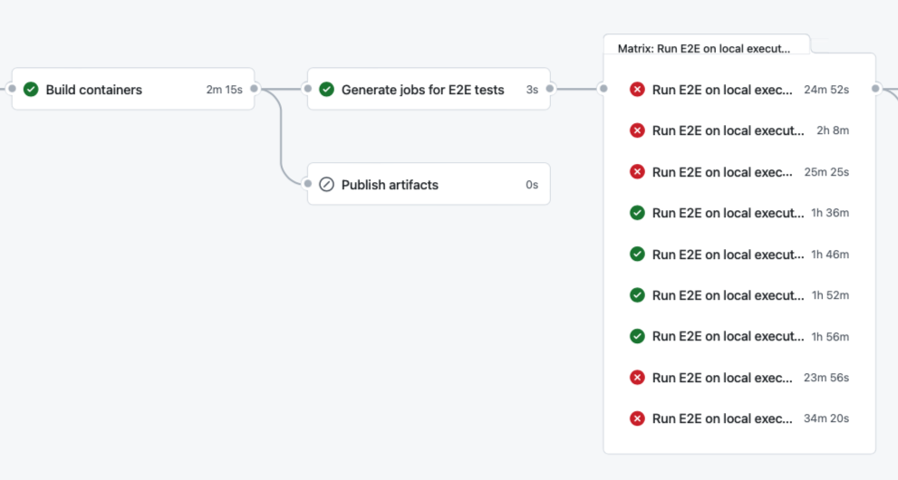
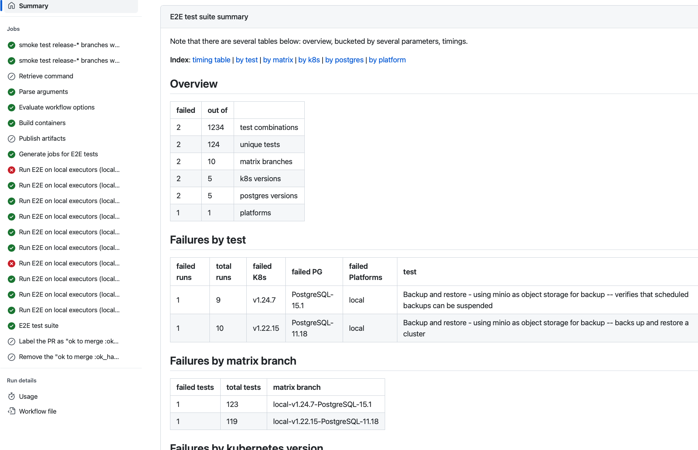

At CloudNativePG we take testing seriously; particularly end-to-end testing. The
CloudNativePG operator needs to work across different versions of Kubernetes and
PostgreSQL. We have an extensive test suite (over 100 end-to-end tests) that we
run on several combinations of versions of Postgres and Kubernetes, as part of
our Continuous Integration pipeline.

We are using GitHub Actions in our github repository, and a
[`strategy: matrix`](https://docs.github.com/en/actions/using-jobs/using-a-matrix-for-your-jobs)
handles generating jobs for each combination of versions of Kubernetes and
Postgres we want to run the test suite on.

This can blow up quickly. In the image below, you can see a matrix with 9
*branches*, five of which have errors in the End-to-End Test suite.



Without going into each branch to investigate which tests fail, we don't know if
there is a pattern to the failures. Did the same tests fail on all the branches?
On branches with failures, are there many failed tests, or few? Are there any
noteworthy patterns to the failures?

Investigating test failures becomes a time sink. And 9 branches are not even
that much; internally at EDB we test more combinations, including the different
cloud providers, for our closed source operators. It is not uncommon for us to
have on the order of 80 matrix branches.

With this much data volume, information gets
[lost ... like ... tears in rain](https://www.imdb.com/title/tt0083658/quotes/qt0378266).

At EDB we developed a system using a GitHub App that ingested test data into an
Elastic database, connected to a Grafana dashboard. This enabled us to get a
quick overview of failures in CI test runs.

But this system was not free, and therefore could not be made available to the
CloudNativePG community. We sorely missed having the functionality available.

## CIclops

We decided to take the spirit of our CI test suite scanner, and the new tool
`ciclops` was born.

CIclops (*ciclops*, pronounced either cyclops or "see I clops") provides an
intelligible overview of the test executions *in a single run* of our CI
pipeline. It does so by taking as input JSON artifacts for each test executed,
on each branch in a given CI run. It computes a summary based on classifying
failures into several buckets of interest, and displays it as a
[GitHub Job Summary](https://github.blog/2022-05-09-supercharging-github-actions-with-job-summaries/):



In the example above, we see at a glance that two matrix branches have failures,
but only two tests have failed in the whole suite (2 test combinations out of
12340). The failed tests affect two versions of Kubernetes and two versions of
PostgreSQL.
Right away we can start getting an idea. Perhaps, in this case, we could
conclude that the `Backup and restore` tests are showing a bit of brittleness.
We might try again with laxer timeouts in some of the test assertions. But we
could also conclude that the tests are mostly in good shape.

CIclops is available with the same open-source license and collaboration model
as CloudNativePG.
This is [the repository](https://github.com/cloudnative-pg/ciclops).
Feel free to use it, fork it, and contribute to it!

## Technical details

CIclops is a [GitHub Action](https://docs.github.com/en/actions), built with
Python and deployed using a Docker image.
The documentation contains explanations on building the GitHub Action, so it
might serve as a good tutorial if you want to build your own Docker-based GitHub
Action.

While the development of CIclops has been guided by our use case of testing a
Kubernetes operator for PostgreSQL databases, the model is usable more
generally:

1. get the test execution in each matrix branch to produce a JSON report with
  the results
1. transform the JSON reports produced previously into a series of JSON files,
  one per test run, with a normalized schema (details below)
1. have a step in the CI pipeline to collect all the normalized JSON files
  produced in all the matrix branches, and place them all in a single directory
1. invoke `ciclops` passing the location of the directory produced in the
  previous step

This is the normalized schema CIclops expects for the input files:

``` json
{
    "name": "InitDB settings - custom default locale -- use the custom default locale specified",
    "state": "passed",
    "start_time": "2021-11-29T18:29:12.613387+01:00",
    "end_time": "2021-11-29T18:31:07.988145+01:00",
    "error": "",
    "error_file": "",
    "error_line": 0,
    "platform": "local",
    "postgres_kind": "PostgreSQL",
    "matrix_id": "id1",
    "postgres_version": "11.1",
    "k8s_version": "22",
    "workflow_id": 12,
    "repo": "my-repo",
    "branch": "my-branch"
}
```

As you can see, there are fields to describe the test failure, but also fields
to describe the versions of PostgreSQL and Kubernetes where the test failure
happened.

The project `README.md` file contains instructions on using `ciclops` as part of
your GithHub workflow. In addition, the CloudNativePG operator's
[continuous delivery workflow](https://github.com/cloudnative-pg/cloudnative-pg/blob/main/.github/workflows/continuous-delivery.yml),
which uses `ciclops`, should serve as a live example.

We hope the project can serve you either directly, or as a starting point to
your own forks.
We would be happy to hear of suggestions for improvement, and even happier to
receive pull requests.
Enjoy!
